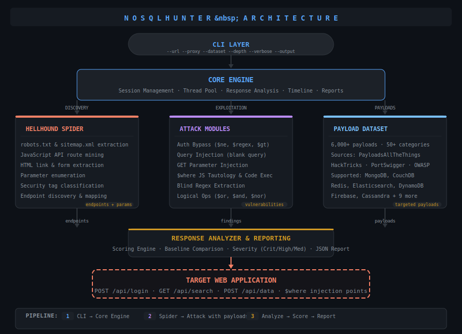
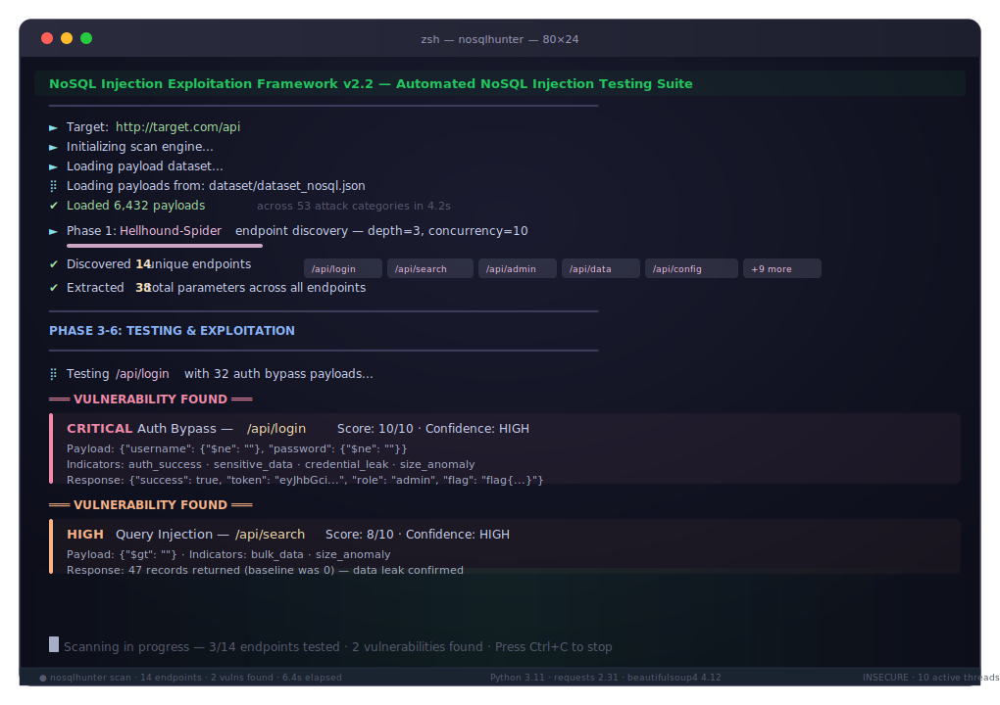

<p align="center">
  
  
  
  
</p>

<p align="center">
  
  
  
  
  
  
  
</p>

```
          __   _____  ____  _   _  _____  _   _  _____  _   _
         / \  / _ \ \/ / \ | | |_  || | | |/ / |_  || | | |
        / _ \| | | \  /|  \| |   | || |_| ' <    | || |_| |
       / ___ \ |_| /  \| |\  |   | ||  _  . \   _| ||  _  |
      /_/   \_\___/_/\_\_| \_|   |_||_| |_|\_\ |___||_| |_|
```

<p align="center">
  <b>Advanced NoSQL Injection Exploitation Framework</b><br>
  <i>Automated detection, exploitation, and data extraction for NoSQL databases</i>
</p>

---

## Overview

**NoSQLHunter** is a comprehensive, automated penetration testing framework designed to detect and exploit NoSQL injection vulnerabilities. It combines a powerful spider engine, extensive payload dataset, and intelligent response analysis to identify security flaws in applications using MongoDB, CouchDB, Redis, Elasticsearch, DynamoDB, and 10+ other NoSQL databases.

### Key Features

- **Hellhound Spider** — Automated endpoint discovery with JS parsing, robots.txt/sitemap extraction
- **16 Database Support** — MongoDB, CouchDB, Redis, Elasticsearch, DynamoDB, Cassandra, Firebase, HBase, Neo4j, Couchbase, ArangoDB, OrientDB, RavenDB, InfluxDB, FaunaDB, Firestore
- **50+ Attack Categories** — Comprehensive payload dataset compiled from PayloadsAllTheThings, HackTricks, PortSwigger, OWASP, and CTF writeups
- **Multiple Attack Vectors**
  - Auth bypass (`$ne`, `$gt`, `$regex`, `$exists`)
  - Query injection (blank query, generic operators)
  - GET parameter injection (URL-encoded operators)
  - `$where` JavaScript tautology & code execution
  - Error-based data exfiltration
  - Blind regex character-by-character brute force
  - Logical operators (`$or`, `$and`, `$nor`, `$in`, `$nin`)
- **Smart Analysis** — Response scoring with baseline comparison, sensitive data detection, size anomaly detection
- **Timeline Reporting** — Chronological event log with vulnerability summary
- **Concurrent Scanning** — Multi-threaded architecture for fast scanning
- **Proxy Support** — Compatible with Burp Suite, ZAP, mitmproxy

---

## Architecture

<p align="center">
  
</p>

The framework follows a modular pipeline architecture:
1. **CLI Layer** parses user arguments and initializes the core engine
2. **Hellhound Spider** discovers endpoints via crawling, robots.txt, sitemap.xml, and JS parsing
3. **Attack Modules** test each endpoint with categorized payloads (auth bypass, query injection, GET params, `$where` JS, blind regex)
4. **Payload Dataset** provides 6000+ injection payloads across 50+ categories for 16 database engines
5. **Response Analyzer** scores responses using baseline comparison, sensitive data detection, and anomaly detection
6. **Output & Reporting** generates chronological timeline, severity-classified findings, and JSON reports

---

## Installation

### From PyPI (coming soon)

```bash
pip install nosqlhunter
```

### From Source

```bash
# Clone the repository
git clone https://github.com/aBadRoy/NoSQLHunter.git
cd NoSQLHunter

# Install dependencies
pip install -r requirements.txt

# Install as package (optional)
pip install .
```

### Quick Start (no installation)

```bash
python nosql_exploit.py --url http://target.com
```

---

## Usage

### Basic Scan

```bash
nosqlhunter --url http://target.com/api
```

### With Verbose Output & Report

```bash
nosqlhunter --url http://target.com --verbose --output report.json
```

### Through Proxy (Burp Suite)

```bash
nosqlhunter --url http://target.com --proxy http://127.0.0.1:8080
```

### Custom Scan Configuration

```bash
nosqlhunter --url http://target.com \
            --depth 5 \
            --concurrency 20 \
            --dataset custom_payloads.json \
            --verbose \
            --output scan_report.json
```

### Using Python Module

```bash
python -m nosqlhunter --url http://target.com -v
```

### Using the Original Standalone Script

```bash
python nosql_exploit.py --url http://target.com --dataset dataset/dataset_nosql.json -v -o report.json
```

---

## Options

| Argument | Short | Description | Default |
|----------|-------|-------------|---------|
| `--url` | `-u` | Target base URL **(required)** | — |
| `--proxy` | `-p` | Proxy URL (e.g. `http://127.0.0.1:8080`) | — |
| `--dataset` | `-d` | Path to payload dataset JSON | `dataset/dataset_nosql.json` |
| `--depth` | `-D` | Crawl depth | `3` |
| `--concurrency` | `-c` | Concurrent requests | `10` |
| `--verbose` | `-v` | Enable verbose logging | `false` |
| `--output` | `-o` | Save JSON report to file | — |

---

## Attack Modules

### Auth Bypass
Attempts to bypass authentication using NoSQL operator injection (`$ne`, `$regex`, `$gt`, `$exists`) against login endpoints.

### Query Injection
Injects blank queries and generic NoSQL operators to extract unauthorized data.

### GET Parameter Injection
URL-encodes NoSQL operators in GET parameters to test for injection vulnerabilities.

### Data Extraction
Attempts to extract data records from vulnerable endpoints using blank query injections.

### `$where` JavaScript Injection
Tests for server-side JavaScript injection via the `$where` operator, including:
- Tautology attacks
- Time-based detection (`sleep()`)
- Error-based data exfiltration
- Prototype pollution

### Blind Regex Extraction
Character-by-character blind extraction of field values using `$regex` patterns.

---

## Dataset

The payload dataset (`dataset/dataset_nosql.json`) contains **6000+ payloads** across **50+ categories** covering:

| Category | Description |
|----------|-------------|
| `$ne` | Not-equal operator variants (auth bypass) |
| `$gt`/`$lt` | Comparison operator injections |
| `$regex` | Regex pattern injections with options |
| `$exists` | Field existence checks |
| `$in`/`$nin` | Array membership operators |
| `$or`/`$and`/`$nor` | Logical operator injections |
| `$where` Tautology | JavaScript expression injections |
| `$where` Code Exec | Server-side JS code execution |
| `$where` Error Exfil | Error-based data extraction |
| Blind Regex | Length detection & char extraction |

Sources include: PayloadsAllTheThings, HackTricks, PortSwigger, OWASP, NosqlMap, NoSQLAttack, exploit-db, CVE database, and CTF writeups.

---

## Demo

<p align="center">
  
</p>

---

## Legal Disclaimer

> **NoSQLHunter is intended for authorized security testing and educational purposes only.**
>
> Users must obtain explicit written permission from system owners before testing.
> Unauthorized access to computer systems is illegal. The authors assume no liability
> for misuse or damage caused by this tool.

---

## License

This project is licensed under the MIT License — see [LICENSE](LICENSE) for details.

---

## Contributing

Contributions are welcome! Please feel free to submit a Pull Request.

1. Fork the repository
2. Create your feature branch (`git checkout -b feature/amazing-feature`)
3. Commit your changes (`git commit -m 'Add amazing feature'`)
4. Push to the branch (`git push origin feature/amazing-feature`)
5. Open a Pull Request

---

<p align="center">
  <sub>Built with 🔥 for the security community</sub>
</p>
